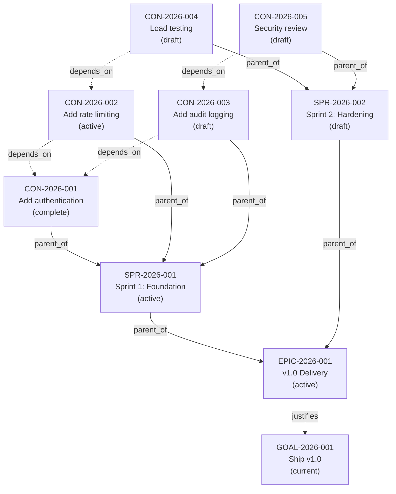
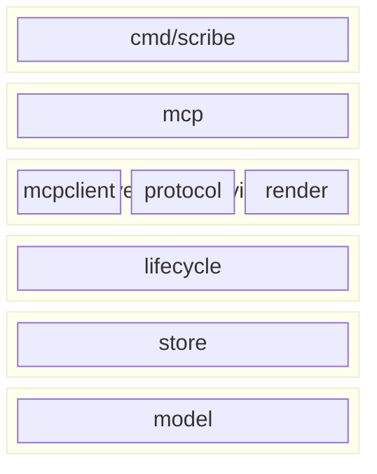
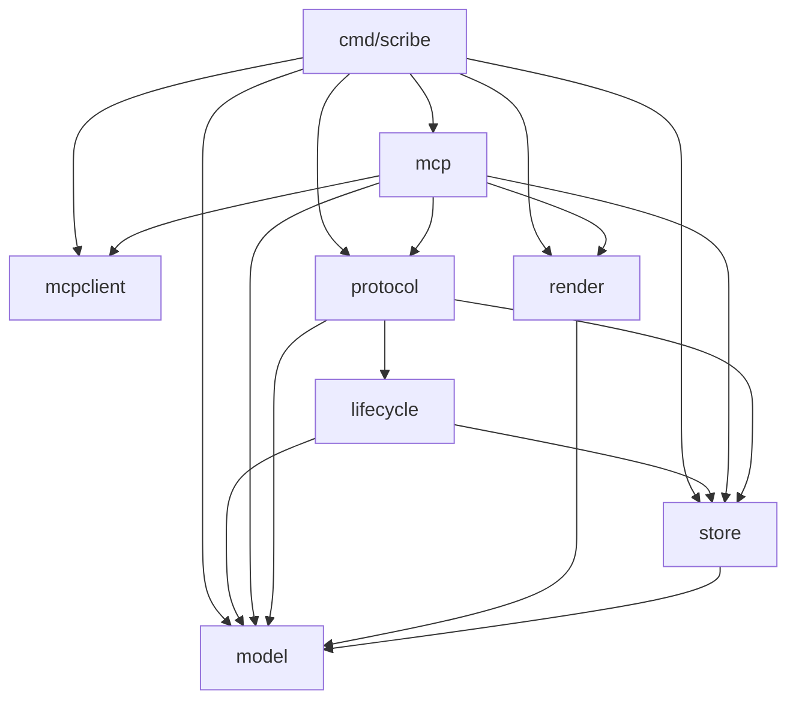

# Scribe

Persistent planning memory for AI agents. Scribe is a structured artifact store that lets AI coding assistants plan, track, and recall work across sessions -- beyond the limits of a single context window.

## Quick Start

### Container (recommended)

```bash
# podman or docker
podman run -d --name scribe \
  -p 8080:8080 \
  -v scribe-data:/data \
  quay.io/dpopsuev/scribe:0.1.0
```

### Binary

```bash
go install github.com/dpopsuev/scribe/cmd/scribe@v0.1.0
scribe serve                   # stdio (Cursor, Claude Desktop)
scribe serve --transport http  # Streamable HTTP on :8080
```

### MCP Configuration

**Cursor / Claude Desktop (stdio -- local binary):**

```json
{
  "mcpServers": {
    "scribe": {
      "command": "scribe",
      "args": ["serve"]
    }
  }
}
```

**Cursor / Claude Desktop (HTTP -- container):**

```json
{
  "mcpServers": {
    "scribe": {
      "url": "http://localhost:8080/"
    }
  }
}
```

## The Problem

LLM context windows are finite. A coding agent can hold ~100K tokens in working memory. When a session ends, everything it learned -- goals, decisions, dependencies, progress -- evaporates.

This creates three failure modes:

1. **Amnesia.** The agent re-discovers the same codebase from scratch every session.
2. **Drift.** Multi-session work loses coherence because there's no shared record of what was decided and why.
3. **Fragmentation.** Plans scattered across chat logs, markdown files, and issue trackers can't be queried or traversed as a graph.

Scribe solves this by giving agents a structured, persistent memory they can read and write through MCP tools -- a place to store plans, contracts, sprints, goals, and their relationships in a queryable DAG.

## Core Concepts

| Concept | What it is |
|---|---|
| **Artifact** | The universal record. Everything is an artifact: contracts, sprints, goals, specs, tasks, bugs, notes. Each has a kind, status, scope, and auto-generated ID (e.g. `CON-2026-042`). |
| **Contract** | The primary unit of work. A contract is a promise to deliver a specific outcome -- it carries a goal statement, design sections, acceptance criteria, and dependency edges. Think of it as a lightweight RFC or work item that an agent can read, execute against, and mark complete. |
| **Kind** | The type of artifact. Built-in kinds: `contract`, `sprint`, `goal`, `epic`, `story`, `task`, `subtask`, `bug`, `spike`, `specification`, `rule`, `note`, `doc`, `architecture`, `batch`, `binder`. Custom kinds are accepted (open world). |
| **Status** | Lifecycle state: `draft` &rarr; `active` &rarr; `complete` / `dismissed`. Also: `current` (goals), `open` (bugs), `promoted`, `retired`, `archived`. |
| **Scope** | The project or repository an artifact belongs to (e.g. `locus`, `origami`). Enables multi-project planning from a single Scribe instance. |
| **Section** | A named text block attached to an artifact. Use for design notes, mermaid diagrams, acceptance criteria, or any structured content. |
| **Edge** | A directed relationship: `parent_of`, `depends_on`, `justifies`, `implements`, `documents`, `satisfies`. Edges form a DAG that agents can traverse. |
| **Goal** | The north-star artifact for a scope. Setting a goal auto-creates a root delivery epic and archives any previous goal. |
| **Sprint** | A time-boxed container. Child contracts are the work items. Tree views show progress at a glance. |

### Example Artifact Graph



Solid arrows are `parent_of` edges (tree structure). Dashed arrows are `depends_on` edges (sequencing). The agent walks this graph to find what to work on next: the highest-priority unblocked contract whose dependencies are all complete.

## Workflow

In the intended mode of operation, **the agent does all of this for you**. You describe what you want in natural language -- "plan a sprint for auth and rate limiting" -- and the agent calls the Scribe MCP tools to create goals, sprints, contracts, sections, and status updates on your behalf. The CLI examples below show what's happening under the hood; you shouldn't need to run them manually.

### 1. Set a goal

The agent (or you) sets the north star for a project scope:

```bash
scribe goal set "Ship v1.0 with full MCP coverage" --scope myproject
```

This creates a `GOAL` artifact (status: `current`) and a root `EPIC` linked via `justifies`.

### 2. Plan work

Create contracts (work items) under the epic. Group them into sprints:

```bash
scribe create --kind sprint --title "Sprint 1: Foundation" --scope myproject
scribe create --kind contract --title "Add authentication" --parent SPR-2026-001 --scope myproject
scribe create --kind contract --title "Add rate limiting" --parent SPR-2026-001 --depends-on CON-2026-001 --scope myproject
```

Attach design details as sections:

```bash
scribe section add CON-2026-001 design "JWT-based auth with refresh tokens. See arch diagram."
scribe section add CON-2026-001 acceptance "All endpoints require valid JWT. Refresh within 5min window."
```

### 3. Execute

As agents work through contracts, they update status:

```bash
scribe set CON-2026-001 status active    # starting work
scribe set CON-2026-001 status complete  # done
```

Guards enforce consistency:
- A sprint can't be completed if it has non-complete children.
- When all children of a parent are terminal, the parent auto-completes.
- When the root epic completes, the goal auto-archives.
- Archived artifacts are read-only.

### 4. Resume

Every new session starts with `motd` (message of the day) to restore context:

```bash
scribe motd
```

Returns current goals, due reminders, and recent notes -- enough for an agent to pick up where it left off without re-reading the entire history.

### 5. Query

Search, filter, and traverse the artifact graph:

```bash
scribe list --kind contract --status active --scope myproject
scribe search "authentication"
scribe tree SPR-2026-001           # sprint board as a tree
scribe inventory                    # dashboard: counts by kind, status, active sprints
```

## Architecture

> Diagrams generated by [Locus](https://github.com/dpopsuev/locus) (`locus diagram`).

### Layer Diagram



### Dependency Graph



### Packages

| Package | Role |
|---|---|
| `cmd/scribe` | CLI entry point. Every MCP tool has a CLI equivalent. |
| `mcp` | MCP server. Thin handlers that delegate to `protocol`. |
| `protocol` | All business logic. Both CLI and MCP are wrappers around this. |
| `model` | Data model: `Artifact`, `Section`, `Edge`, `Filter`, `Schema`. |
| `store` | Persistence interface + SQLite implementation. |
| `lifecycle` | Guards (archived=readonly, delete-requires-archived), archive with cascade, vacuum. |
| `render` | Markdown and table formatters for CLI and MCP output. |
| `mcpclient` | Optional client for cross-tool communication (e.g. querying Locus). |

### Storage

Single SQLite database (CGo-free via `modernc.org/sqlite`). Three tables:

- **artifacts** -- all fields as columns, JSON for arrays/maps (sections, labels, depends_on, links, extra).
- **edges** -- directed graph: `(from, to, relation)` with a unique constraint.
- **sequences** -- auto-increment counters per ID prefix (CON, SPR, GOAL, ...).

Default location: `~/.scribe/scribe.sqlite` (binary) or `/data/scribe.sqlite` (container).

### Data Model

Every artifact carries:

- **Identity:** auto-generated ID (`PREFIX-YYYY-SEQ`), kind, scope
- **Content:** title, goal statement, named sections (arbitrary text blocks)
- **Graph:** parent, depends_on edges, typed links (justifies, implements, documents, satisfies)
- **Lifecycle:** status, priority, sprint assignment, labels, timestamps
- **Extension:** `extra` map for domain-specific key-value pairs (reminders, custom fields)

The schema is open-world: unknown kinds get an auto-derived prefix, unknown fields go into `extra`.

## MCP Tools

| Tool | Description |
|---|---|
| `motd` | Message of the day: current goals, due reminders, recent notes. Start here. |
| `create_artifact` | Create a new artifact with kind, title, scope, parent, dependencies, labels. |
| `get_artifact` | Retrieve a single artifact by ID with all sections and metadata. |
| `list_artifacts` | List with filters (kind, scope, status, parent, sprint), grouping, sorting, limits. |
| `search_artifacts` | Substring search across title, goal, and section text. |
| `set_field` | Set any field on an artifact (status, title, parent, sprint, labels, etc.). |
| `set_goal` | Set the north-star goal for a scope. Archives previous goal, creates root epic. |
| `attach_section` | Add or replace a named text section on an artifact. |
| `get_section` | Retrieve a section's text by name. |
| `contract_tree` | Render the parent-child tree rooted at any artifact. |
| `link_artifacts` | Add directed relationships (parent_of, depends_on, justifies, implements, documents, satisfies). |
| `unlink_artifacts` | Remove directed relationships. |
| `archive_artifact` | Archive artifacts (marks read-only). Cascade archives entire subtrees. |
| `vacuum` | Delete archived artifacts older than N days. |
| `inventory` | Dashboard: total count, breakdown by kind/status, active sprints, goals. |
| `context_mesh` | Query Locus for codebase architecture related to an artifact's scope. |
| `detect_overlaps` | Find active artifacts sharing component labels (scope conflict detection). |
| `drain_discover` | List legacy .md files for agent-driven migration into Scribe. |
| `drain_cleanup` | Delete migrated .md files after confirmation. |

## Configuration

Scribe works with zero configuration. For customization, create a `scribe.yaml`:

```yaml
# scribe.yaml
db: ~/.scribe/scribe.sqlite
transport: stdio
addr: ":8080"

scopes:
  - myproject

schema:
  kinds:
    contract:      { prefix: CON }
    sprint:        { prefix: SPR }
    goal:          { prefix: GOAL }
    epic:          { prefix: EPIC }
    task:          { prefix: TASK }
    bug:           { prefix: BUG }
    note:          { prefix: NOTE, exclude_from_list: true }
    # add your own:
    # rfc:         { prefix: RFC }
    # adr:         { prefix: ADR }

  statuses:
    - draft
    - active
    - current
    - complete
    - dismissed
    - archived

  guards:
    archived_readonly: true
    completion_requires_children_complete: true
    auto_archive_goal_on_justify_complete: true
    delete_requires_archived: true
    auto_complete_parent_on_children_terminal: true
    auto_activate_next_draft_sprint: true
```

**Resolution order:** `--config` flag > `$SCRIBE_CONFIG` > `./scribe.yaml` > `$SCRIBE_ROOT/scribe.yaml` > `~/.scribe/scribe.yaml` > built-in defaults.

**Override chain:** CLI flags > environment variables > config file > defaults.

For containers, mount a config file at `/data/scribe.yaml`:

```bash
podman run -d --name scribe \
  -p 8080:8080 \
  -v scribe-data:/data \
  -v ./scribe.yaml:/data/scribe.yaml \
  quay.io/dpopsuev/scribe:0.1.0
```

## Environment Variables

| Variable | Default | Description |
|---|---|---|
| `SCRIBE_ROOT` | `~/.scribe` | Storage root; sets default DB and config paths |
| `SCRIBE_DB` | `$SCRIBE_ROOT/scribe.sqlite` | Database path (overrides `SCRIBE_ROOT`) |
| `SCRIBE_TRANSPORT` | `stdio` | Transport: `stdio` or `http` |
| `SCRIBE_ADDR` | `:8080` | Listen address (HTTP transport only) |
| `SCRIBE_CONFIG` | `./scribe.yaml` or `$SCRIBE_ROOT/scribe.yaml` | Path to config file (first found wins) |

## License

MIT
