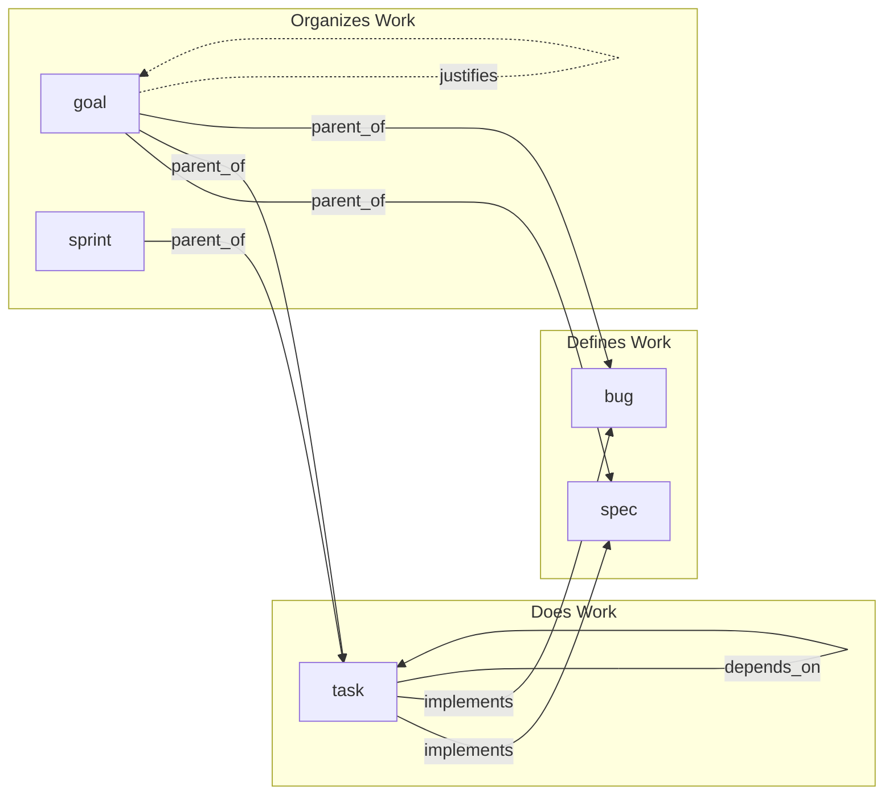
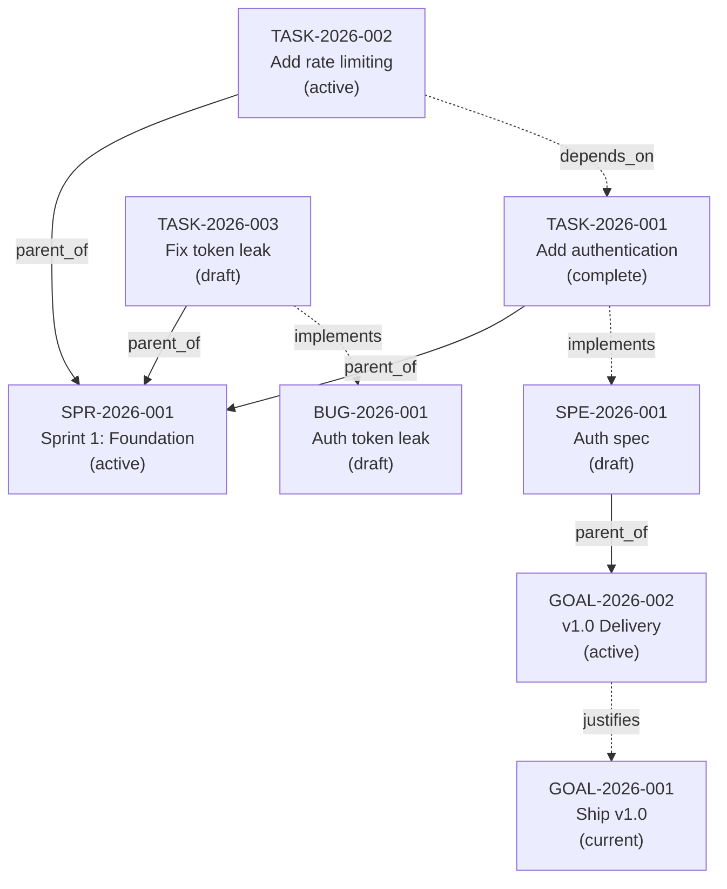
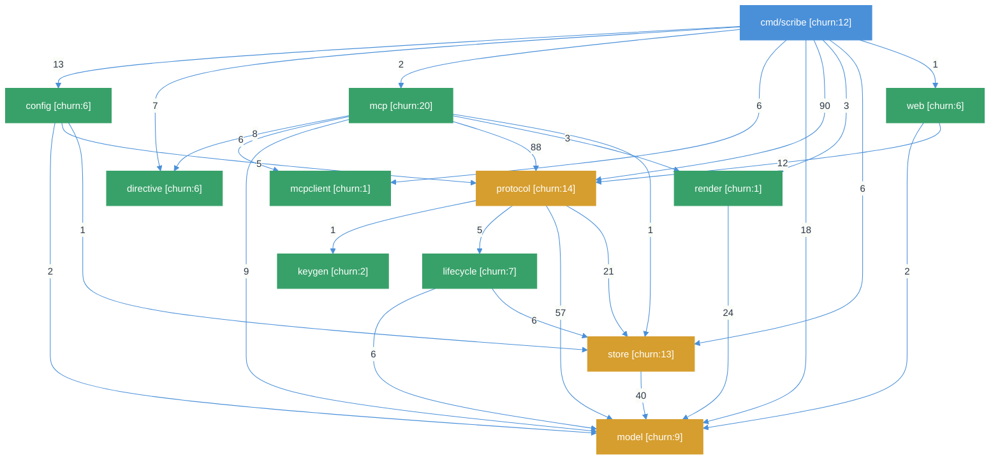
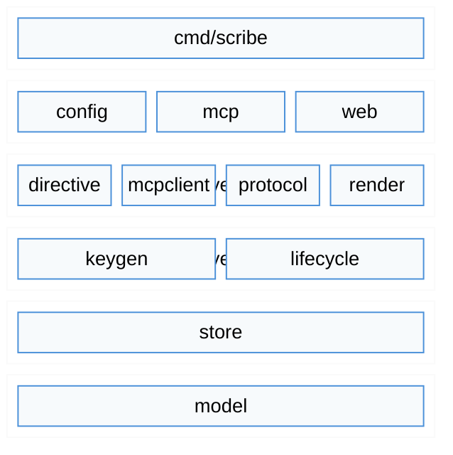

<p align="center">
  
</p>

# Scribe

Work graph for AI agents. Scribe is a structured artifact store with native DAG support that lets AI coding assistants plan, track, and recall work across sessions -- beyond the limits of a single context window.

## Quick Start

### Container (recommended)

```bash
# podman or docker
podman run -d --name scribe \
  -p 8080:8080 \
  -v scribe-data:/data \
  quay.io/dpopsuev/scribe:0.3.0
```

### Binary

```bash
go install github.com/dpopsuev/scribe/cmd/scribe@v0.3.0
scribe serve                   # stdio (Cursor, Claude Desktop)
scribe serve --transport http  # Streamable HTTP on :8080
```

### MCP Configuration

**Cursor / Claude Desktop (stdio -- local binary):**

```json
{
  "mcpServers": {
    "scribe": {
      "command": "scribe",
      "args": ["serve"]
    }
  }
}
```

**Cursor / Claude Desktop (HTTP -- container):**

```json
{
  "mcpServers": {
    "scribe": {
      "url": "http://localhost:8080/?workspace=origami"
    }
  }
}
```

## Workflow

Scribe is designed for natural language. You talk to your agent, and it builds the work graph behind the scenes.

> **You:** Plan a sprint for authentication and rate limiting. Write specs first.
>
> **Agent:** *(creates 2 specs, 1 sprint, 3 tasks, links them)* Done. I created specs for "OAuth2 authentication" and "API rate limiting", a sprint called "Sprint 1: Foundation", and 3 tasks implementing those specs. The rate-limiting task depends on auth being done first. Here's the board...

> **You:** I finished the auth task. What's next?
>
> **Agent:** *(marks task complete, checks dependencies)* Auth is done. The rate-limiting task is now unblocked — it was waiting on auth. I've marked it active. The sprint has 1 of 3 tasks complete.

> **You:** We found a token leak bug. Track it.
>
> **Agent:** *(creates bug, creates task implementing it, adds to sprint)* Filed `BUG-2026-001: Auth token leak`. Created a task to fix it and added it to the current sprint. The sprint now has 4 tasks: 1 complete, 1 active, 2 draft.

> **You:** Show me the sprint board.
>
> **Agent:** *(calls tree on the sprint)* Here's the full tree with status, dependencies, and which specs/bugs each task implements. You're 25% through the sprint.

## The Problem

LLM context windows are finite. A coding agent can hold ~100K tokens in working memory. When a session ends, everything it learned -- goals, decisions, dependencies, progress -- evaporates.

This creates three failure modes:

1. **Amnesia.** The agent re-discovers the same codebase from scratch every session.
2. **Drift.** Multi-session work loses coherence because there's no shared record of what was decided and why.
3. **Fragmentation.** Plans scattered across chat logs, markdown files, and issue trackers can't be queried or traversed as a graph.

Scribe solves this by giving agents a structured, persistent memory they can read and write through MCP tools -- a place to store goals, specs, tasks, bugs, sprints, and their relationships in a queryable DAG.

## Core Concepts

| Concept | What it is |
|---|---|
| **Artifact** | The universal record. Everything is an artifact with a kind, status, scope, and auto-generated ID (e.g. `TASK-2026-042`). |
| **Kind** | The type of artifact. Canonical kinds: `goal`, `sprint`, `task`, `spec`, `bug`. Enforced by vocabulary validation -- unknown kinds are rejected with a hint to register them via `scribe vocab add`. |
| **Task** | The primary unit of work. A task carries a goal statement, design sections, and dependency edges. Tasks **implement** specs and bugs. |
| **Spec** | A specification: the *what* and *why*. Defines acceptance criteria. Tasks implement specs. |
| **Bug** | A defect record. Like a spec, a bug is resolved by a task that implements it. |
| **Goal** | The north-star artifact for a scope. Setting a goal auto-creates a root delivery artifact and archives any previous goal. |
| **Sprint** | A time-boxed container. Child tasks are the work items. Tree views show progress at a glance. |
| **Status** | Lifecycle state: `draft` &rarr; `active` &rarr; `complete` / `dismissed`. Also: `current` (goals), `retired`, `archived`. |
| **Scope** | The project or repository an artifact belongs to (e.g. `locus`, `origami`). Enables multi-project planning from a single Scribe instance. |
| **Section** | A named text block attached to an artifact. Use for design notes, mermaid diagrams, acceptance criteria, or any structured content. |
| **Edge** | A directed relationship: `parent_of`, `depends_on`, `justifies`, `implements`, `documents`, `satisfies`. Edges form a DAG that agents can traverse. |

### Artifact Relationships



**Specs** and **bugs** define *what* needs to happen. **Tasks** do the work by implementing specs or resolving bugs. **Sprints** group tasks into time-boxed iterations. **Goals** sit at the top as north-star containers. The `detect_orphans` tool warns when a task has no spec/bug link, or when a spec/bug has no task implementing it.

### Example Artifact Graph



Solid arrows are `parent_of` edges (tree structure). Dashed arrows are `implements`, `depends_on`, or `justifies` edges (semantics). The agent walks this graph to find what to work on next: the highest-priority unblocked task whose dependencies are all complete.

## Architecture

> Diagrams generated by [Locus](https://github.com/dpopsuev/locus) (`locus diagram --theme natural`). Components colored by health: green = healthy, yellow = sick (fan-in >= 3, churn >= 8), red = fatal.

### Dependency Graph

> `locus diagram /path/to/scribe --type dependency --theme natural`



### Layer Diagram

> `locus diagram /path/to/scribe --type layers --theme natural`



### Packages

| Package | Churn | Role |
|---|---|---|
| `cmd/scribe` | 12 | CLI entry point. Every MCP tool has a CLI equivalent. |
| `mcp` | 20 | MCP server. Thin handlers that delegate to `protocol`. |
| `protocol` | 14 | All business logic. Both CLI and MCP are wrappers around this. |
| `model` | 9 | Data model: `Artifact`, `Section`, `Edge`, `Filter`, `Schema`. |
| `store` | 13 | Persistence interface + SQLite implementation. |
| `lifecycle` | 7 | Guards (archived=readonly, delete-requires-archived), archive with cascade, vacuum. |
| `render` | 1 | Markdown and table formatters for CLI and MCP output. |
| `config` | 6 | Configuration loading, workspace definitions, schema. |
| `directive` | 6 | MCP tool registry and input validation. |
| `keygen` | 2 | Auto-generated ID sequences per artifact kind. |
| `mcpclient` | 1 | Optional client for cross-tool communication (e.g. querying Locus). |
| `web` | 6 | Web UI for artifact browsing and sprint boards. |

### Storage

Single SQLite database (CGo-free via `modernc.org/sqlite`). Three tables:

- **artifacts** -- all fields as columns, JSON for arrays/maps (sections, labels, depends_on, links, extra).
- **edges** -- directed graph: `(from, to, relation)` with a unique constraint.
- **sequences** -- auto-increment counters per ID prefix (CON, SPR, GOAL, ...).

Default location: `~/.scribe/scribe.sqlite` (binary) or `/data/scribe.sqlite` (container).

### Data Model

Every artifact carries:

- **Identity:** auto-generated ID (`PREFIX-YYYY-SEQ`), kind, scope
- **Content:** title, goal statement, named sections (arbitrary text blocks)
- **Graph:** parent, depends_on edges, typed links (justifies, implements, documents, satisfies)
- **Lifecycle:** status, priority, sprint assignment, labels, timestamps
- **Extension:** `extra` map for domain-specific key-value pairs (reminders, custom fields)

The vocabulary is enforced: unknown kinds are rejected with a hint to register them via `scribe vocab add`. Unknown fields go into `extra`.

## MCP Tools

| Tool | Description |
|---|---|
| `artifact` | Create, read, update, and manage work artifacts. Actions: `create`, `get`, `list`, `set`, `archive`, `attach_section`, `get_section`. |
| `graph` | Navigate and modify artifact relationships. Actions: `tree` (hierarchy), `link` (add edge), `unlink` (remove edge). Relations: parent_of, depends_on, justifies, implements, documents, satisfies. |
| `admin` | System administration and monitoring. Actions: `motd` (session context), `dashboard` (health/staleness), `set_goal` (north star), `vacuum` (cleanup), `detect` (orphans/overlaps). |

## LLM Chatbox Examples

Quick reference for what the agent sends over MCP. The Workflow section above shows full conversations.

```json
// Start a session — get goals, reminders, recent notes
{ "tool": "admin", "arguments": { "action": "motd" } }

// Create a spec and a task implementing it
{ "tool": "artifact", "arguments": { "action": "create", "kind": "spec", "title": "OAuth2 authentication", "scope": "myproject" } }
{ "tool": "artifact", "arguments": { "action": "create", "kind": "task", "title": "Implement OAuth2 flow", "scope": "myproject" } }
{ "tool": "graph", "arguments": { "action": "link", "id": "TASK-2026-001", "relation": "implements", "targets": ["SPE-2026-001"] } }

// Sprint board as a tree
{ "tool": "graph", "arguments": { "action": "tree", "id": "SPR-2026-001" } }

// Mark task done
{ "tool": "artifact", "arguments": { "action": "set", "id": "TASK-2026-001", "field": "status", "value": "complete" } }

// Find orphaned tasks (no spec/bug link)
{ "tool": "admin", "arguments": { "action": "detect", "check": "all", "scope": "myproject" } }

// Housekeeping dashboard
{ "tool": "admin", "arguments": { "action": "dashboard", "stale_days": 14 } }
```

## Configuration

Scribe works with zero configuration. For customization, create a `scribe.yaml`:

```yaml
# scribe.yaml
db: ~/.scribe/scribe.sqlite
transport: stdio
addr: ":8080"

scopes:
  - myproject

vocabulary:
  kinds:
    - goal
    - sprint
    - task
    - spec
    - bug
    # add your own via: scribe vocab add <kind>

schema:
  kinds:
    goal:          { prefix: GOAL }
    sprint:        { prefix: SPR }
    task:          { prefix: TASK }
    spec:          { prefix: SPE }
    bug:           { prefix: BUG }
    note:          { prefix: NOTE, exclude_from_list: true }

  statuses:
    - draft
    - active
    - current
    - complete
    - dismissed
    - archived

  guards:
    archived_readonly: true
    completion_requires_children_complete: true
    auto_archive_goal_on_justify_complete: true
    delete_requires_archived: true
    auto_complete_parent_on_children_terminal: true
    auto_activate_next_draft_sprint: true

workspaces:
  origami: [origami, asterisk, achilles]
  sidecar: [scribe, locus, lex, limes]
```

**Resolution order:** `--config` flag > `$SCRIBE_CONFIG` > `./scribe.yaml` > `$SCRIBE_ROOT/scribe.yaml` > `~/.scribe/scribe.yaml` > built-in defaults.

**Override chain:** CLI flags > environment variables > config file > defaults.

**Workspace connections (HTTP):** Add `?workspace=origami` to the MCP URL to scope a connection to specific scopes.

For containers, mount a config file at `/data/scribe.yaml`:

```bash
podman run -d --name scribe \
  -p 8080:8080 \
  -v scribe-data:/data \
  -v ./scribe.yaml:/data/scribe.yaml \
  quay.io/dpopsuev/scribe:0.3.0
```

## Environment Variables

| Variable | Default | Description |
|---|---|---|
| `SCRIBE_ROOT` | `~/.scribe` | Storage root; sets default DB and config paths |
| `SCRIBE_DB` | `$SCRIBE_ROOT/scribe.sqlite` | Database path (overrides `SCRIBE_ROOT`) |
| `SCRIBE_TRANSPORT` | `stdio` | Transport: `stdio` or `http` |
| `SCRIBE_ADDR` | `:8080` | Listen address (HTTP transport only) |
| `SCRIBE_CONFIG` | `./scribe.yaml` or `$SCRIBE_ROOT/scribe.yaml` | Path to config file (first found wins) |
| `SCRIBE_LOG_LEVEL` | `info` | Log level: `debug`, `info`, `warn`, `error`. JSON to stderr. |
| `SCRIBE_WORKSPACE` | — | Workspace name for stdio transport (resolves scopes from config). |

## License

MIT
